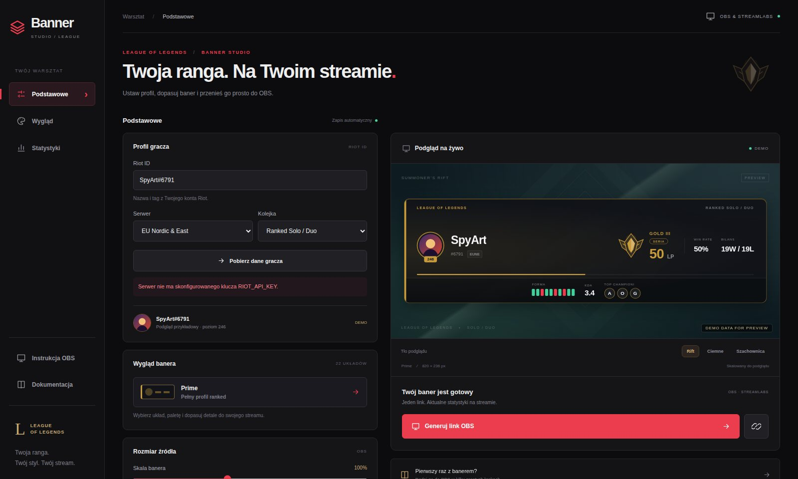
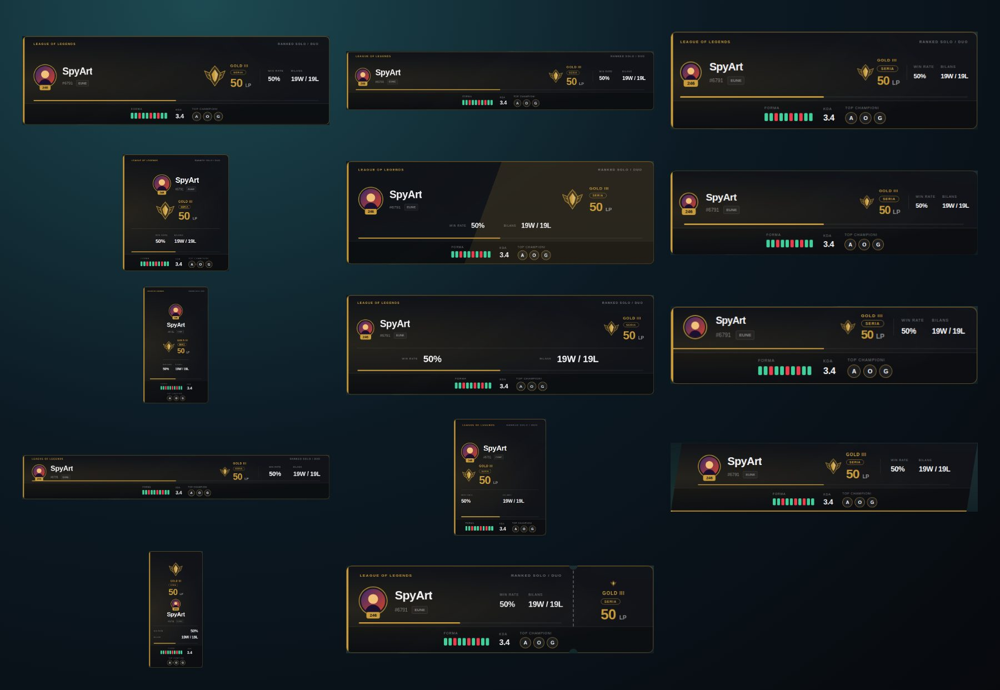
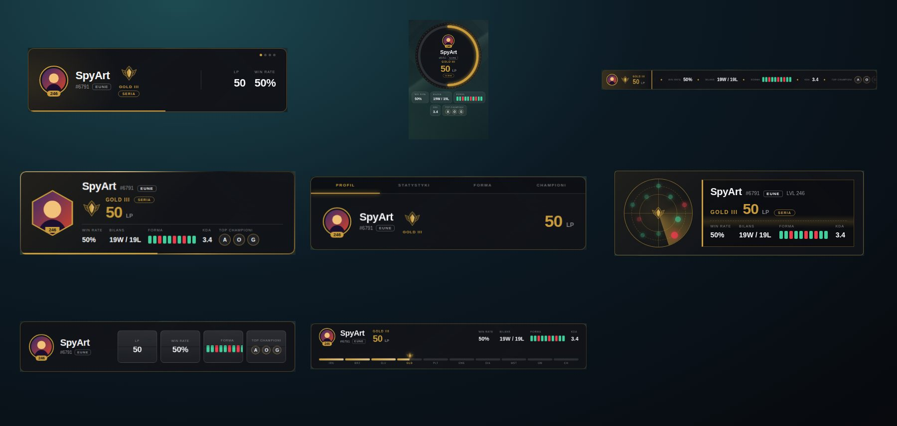
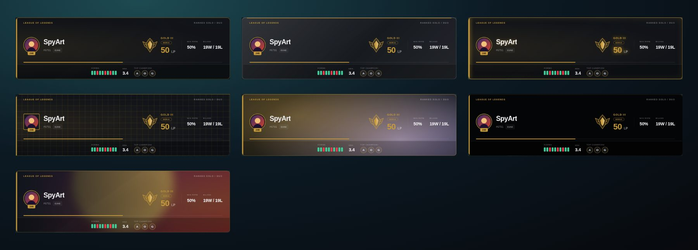
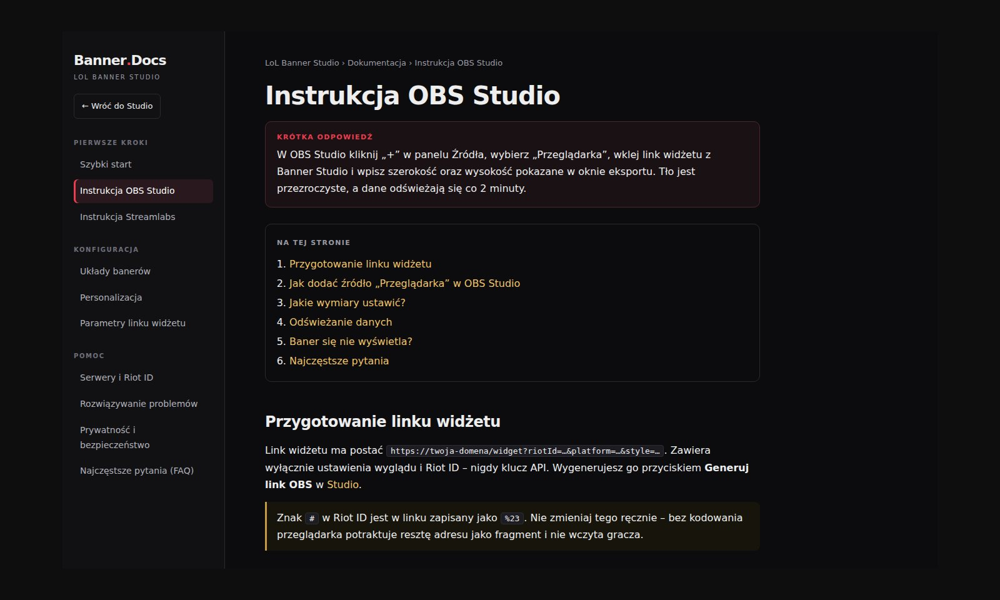

<div align="center">



# LoL Banner Studio

**Baner rankingu League of Legends do OBS: ranga, LP, win rate i statystyki z oficjalnego Riot API na streamie.** Darmowy generator banerów i widżetów LoL do OBS Studio i Streamlabs. Twoja ranga. Twój styl. Twój stream.

[](https://lolbanner.vxh.pl/)
[](https://lolbanner.vxh.pl/docs)
[](./LICENSE)
[](https://developer.riotgames.com/)

[Otwórz generator](https://lolbanner.vxh.pl/) · [Dokumentacja](https://lolbanner.vxh.pl/docs) · [Instrukcja OBS](https://lolbanner.vxh.pl/docs/obs-studio) · [FAQ](https://lolbanner.vxh.pl/docs/faq) · [English](#english)

</div>

---

## Co to jest

Ranga, LP, win rate, bilans wygranych i porażek, forma z ostatnich gier, KDA, top championi i poziom konta League of Legends na Twoim streamie, w **22 układach** i **7 motywach** do wyboru, z wersjami statycznymi i animowanymi. Wpisujesz Riot ID, wybierasz wygląd, kopiujesz link i wklejasz go w OBS jako źródło **Przeglądarka (Browser Source)**. Bez wtyczek, bez konta, bez logowania Riot, za darmo.

Projekt **nie jest powiązany** z Riot Games. Korzysta z oficjalnego Riot API przez własny backend, więc klucz API nigdy nie trafia do przeglądarki ani do linku widżetu.

## Galeria

<div align="center">

**Układy klasyczne (14)**



**Banery animowane (8)**



**Motywy (7)**



</div>

## Najważniejsze funkcje

- **22 układy banera**: 14 klasycznych (Prime, Broadcast, Compact, Showcase, Split, Minimal, Tower, Scoreboard, Slim, Wide, Info, Stripe, Badge, Ticket) i 8 animowanych o własnej budowie (Deck, Orbit, Marquee, Hextech, Tabs, Radar, Flip, Ladder).
- **7 motywów** dla układów klasycznych: Classic, Glass, Neon, Circuit, Aurora (animowany), Amoled i Avatar BG (rozmyty awatar w tle).
- **Dane z oficjalnego Riot API**: Ranked Solo/Duo i Ranked Flex, ranga, LP, wygrane i porażki, win rate, seria wygranych i seria awansowa, forma z ostatnich 10 gier, KDA, CS na minutę, top championi (mastery) i wynik mastery.
- **Stopka statystyk w jednym banerze**: Stopka, Kapsuły, Pierścienie (statyczne) oraz Rotacja i Taśma (animowane).
- **Pełna kontrola wyglądu**: kolor akcentu, tło, tekst, trzy kroje pisma, krycie, zaokrąglenie, skala 60–160%, poświata, tempo animacji, kształt awatara (okrągły, kwadrat, sześciokąt).
- **17 przełączników elementów** z ikonami, m.in. ikona, poziom, tag, serwer, ranga, LP, win rate, bilans, forma, KDA, CS, top championi.
- **16 serwerów LoL** i dwie kolejki rankingowe.
- **Podgląd na żywo** w Studio na kilku scenach, z danymi demo, gdy Riot jeszcze ich nie zwrócił, oraz podgląd z iframe w oknie „Generuj link OBS”.
- **Trzy języki Studio i banerów**: polski, angielski i niemiecki. Przełącznik z flagami w menu, automatyczne wykrywanie języka przeglądarki, język w linku widżetu (`lang=pl|en|de`), tłumaczone etykiety banerów i komunikaty błędów. Dokumentacja `/docs` jest na razie po polsku.
- **Samoodświeżanie**: Studio i widżet wykrywają nową wersję i same się przeładowują.
- **Dokumentacja SSR** w `/docs` z SEO, AEO i GEO (`sitemap.xml`, `llms.txt`, dane strukturalne JSON-LD).

## Szybki start

1. Otwórz [generator](https://lolbanner.vxh.pl/) i wpisz Riot ID w formacie `Nazwa#TAG`, wybierz serwer i kolejkę.
2. W zakładce **Wygląd** wybierz układ i motyw, a w **Statystykach** włącz potrzebne elementy.
3. Kliknij **Generuj link OBS**: zobaczysz podgląd widżetu, adres i wymiary źródła.
4. W OBS dodaj źródło **Przeglądarka (Browser)**, wklej adres i wpisz szerokość oraz wysokość z okna eksportu.

Pełny opis krok po kroku: [Instrukcja OBS Studio](https://lolbanner.vxh.pl/docs/obs-studio) i [Instrukcja Streamlabs](https://lolbanner.vxh.pl/docs/streamlabs).

Przykład linku widżetu:

```text
/widget?riotId=Nazwa%23TAG&platform=euw1&queue=solo&style=crest&theme=glass&scale=100
```

Wszystkie parametry: [Parametry linku widżetu](https://lolbanner.vxh.pl/docs/parametry-url).

## Dokumentacja

<div align="center">



</div>

Dokumentacja jest renderowana po stronie serwera (SSR), więc działa bez JavaScriptu i dobrze się indeksuje:

| Temat | Strona |
|---|---|
| Pierwsze kroki | [Szybki start](https://lolbanner.vxh.pl/docs/szybki-start) · [OBS Studio](https://lolbanner.vxh.pl/docs/obs-studio) · [Streamlabs](https://lolbanner.vxh.pl/docs/streamlabs) |
| Konfiguracja | [Układy banerów](https://lolbanner.vxh.pl/docs/uklady-banerow) · [Personalizacja](https://lolbanner.vxh.pl/docs/personalizacja) · [Parametry linku](https://lolbanner.vxh.pl/docs/parametry-url) |
| Pomoc | [Serwery i Riot ID](https://lolbanner.vxh.pl/docs/serwery-i-riot-id) · [Rozwiązywanie problemów](https://lolbanner.vxh.pl/docs/rozwiazywanie-problemow) · [Prywatność i bezpieczeństwo](https://lolbanner.vxh.pl/docs/prywatnosc-i-bezpieczenstwo) · [FAQ](https://lolbanner.vxh.pl/docs/faq) |

### SEO, AEO i GEO

| Obszar | Co jest w projekcie |
|---|---|
| **SEO** | unikalne tytuły i opisy, canonical, hreflang, Open Graph, `sitemap.xml`, `robots.txt` |
| **AEO** | blok „Krótka odpowiedź” na górze każdej strony, sekcje FAQ, dane `FAQPage`, `HowTo`, `TechArticle`, `BreadcrumbList` |
| **GEO** | `/llms.txt`, `/llms-full.txt`, wersja Markdown każdej strony (`/docs/<strona>.md`), reguły dla robotów AI w `robots.txt` |

Treść dokumentacji jest w jednym miejscu (`server/docs/content.mjs`), a z niej powstają HTML, Markdown i JSON-LD.

## Dla developerów

Wymagania: Node.js 22+ i pnpm 9+.

```bash
corepack enable
pnpm install
cp .env.example .env.dev   # ustaw RIOT_API_KEY
pnpm dev                   # Studio http://localhost:5175, API http://localhost:8787
```

| Polecenie | Co robi |
|---|---|
| `pnpm dev` | serwer API (Node) i serwer deweloperski Vite jednocześnie |
| `pnpm build` | sprawdzenie typów (`tsc`) i build produkcyjny Vite |
| `pnpm start` | uruchomienie serwera API i dokumentacji SSR |
| `pnpm preview` | podgląd zbudowanego frontendu |

Klucz deweloperski Riot wygasa po 24 godzinach. Nigdy nie commituj `.env`, `.env.dev` ani klucza produkcyjnego.

### Zmienne środowiskowe

| Zmienna | Opis |
|---|---|
| `RIOT_API_KEY` | klucz Riot API, czytany w runtime przez backend |
| `RIOT_VERIFY` | kod weryfikacyjny Riot; backend serwuje go pod `/riot.txt` |
| `SITE_URL` | publiczny adres (np. `https://lolbanner.vxh.pl`) dla canonical, sitemapy i obrazka OG |
| `RIOT_APPROVED` | `1` ukrywa komunikat o wersji demonstracyjnej (po akceptacji aplikacji przez Riot Developer Portal) |
| `PORT` | port API (domyślnie `8787`) |

### Struktura projektu

```text
src/                  React: Studio, widżet i banery (klasyczne oraz animowane)
src/AnimatedBanners.tsx  animowane banery o własnej budowie
server/index.mjs      proxy Riot API, cache i limit zapytań
server/docs/          dokumentacja SSR: treść, renderer SEO, trasy, sitemap, llms.txt
deploy/nginx.conf     reverse proxy dla CapRover i routing SPA
Dockerfile            wieloetapowy build: Vite + Nginx + Node API
captain-definition    punkt wejścia wdrożenia CapRover
```

### Przepływ danych

Backend rozwiązuje Riot ID przez `ACCOUNT-V1`, pobiera profil z `SUMMONER-V4`, rangę z `LEAGUE-V4`, top championów z `CHAMPION-MASTERY-V4` i ostatnie mecze z `MATCH-V5`. Data Dragon dostarcza ikony profilu i championów. Odpowiedzi są krótko cache'owane (ok. 90 sekund), a zapytania ograniczone do 60 na minutę z jednego adresu IP. Moduły opcjonalne (mastery, mecze) mają miękką obsługę błędów: awaria jednego nie psuje podstawowych danych banera.

### Stack technologiczny

| Warstwa | Technologia |
|---|---|
| UI | **React 18** + **TypeScript** (strict) |
| Bundler / dev server | **Vite 7** |
| Backend | **Node.js** + **Express 5** |
| Dokumentacja | SSR w Node (HTML, Markdown, JSON-LD z jednego źródła treści) |
| Style | czysty **CSS** (zmienne, `color-mix`, animacje) |
| Pakiety | **pnpm** |
| Wdrożenie | Docker (Node + Nginx), CapRover |

### Wdrożenie (CapRover)

1. Utwórz aplikację w CapRover i wdróż repozytorium metodą Captain Definition.
2. W **App Configs → Environmental Variables** ustaw `RIOT_API_KEY`, `RIOT_VERIFY` i `SITE_URL`.
3. Włącz HTTPS dla domeny aplikacji przed udostępnieniem linku widżetu.

Nginx serwuje zbudowane Studio na porcie 80 i przekazuje `/api/*`, `/docs`, `sitemap.xml`, `robots.txt` i `llms*.txt` do procesu Node. Klucz Riot pozostaje zmienną środowiskową backendu.

## Prywatność i zgodność z Riot

LoL Banner Studio nie prosi o hasło Riot, nie wymaga logowania, nie automatyzuje rozgrywki, nie szacuje ukrytego MMR i nie organizuje turniejów. Ustawienia banera są zapisywane lokalnie w przeglądarce i w linku widżetu, a serwer nie przechowuje danych osobowych ani historii meczów.

> LoL Banner Studio is not endorsed by Riot Games and does not reflect the views or opinions of Riot Games or anyone officially involved in producing or managing Riot Games properties. Riot Games and all associated properties are trademarks or registered trademarks of Riot Games, Inc.

Projekt jest niezależnym narzędziem społeczności, inspirowanym przepływem pracy [FACEIT Banner Studio](https://github.com/skullboypl/faceit-banner-studio).

## English

<details>
<summary><b>LoL Banner Studio</b>: free League of Legends rank overlay generator for OBS Studio and Streamlabs</summary>

**LoL Banner Studio** is a free web-based overlay generator for League of Legends streamers. Enter your Riot ID, pick a server and one of **22 banner layouts** (14 classic and 8 animated) with **7 themes**, then copy a single browser-source URL into OBS Studio or Streamlabs.

- Official Riot API data: rank, LP, wins, losses, win rate, hot streak, promotion series, recent form, KDA, CS per minute, top champions by mastery.
- Ranked Solo/Duo and Ranked Flex, 16 servers.
- Transparent browser-source widget at `/widget`, refreshed every two minutes.
- Server-side Riot API proxy: the API key never reaches the browser or the overlay URL.
- No account, no Riot Sign On, no password. Free and open source (MIT).

Live: [lolbanner.vxh.pl](https://lolbanner.vxh.pl/) · Docs (PL): [lolbanner.vxh.pl/docs](https://lolbanner.vxh.pl/docs) · `llms.txt`: [lolbanner.vxh.pl/llms.txt](https://lolbanner.vxh.pl/llms.txt)

**Keywords:** League of Legends OBS overlay, LoL rank banner, Riot API stream widget, Streamlabs LoL widget, OBS browser source, ranked overlay generator, Twitch streamer tools.

</details>

## Licencja

Projekt jest udostępniony na licencji [MIT](./LICENSE).

<div align="center">

Zrobione przez [Skull](https://github.com/skullboypl) · [lolbanner.vxh.pl](https://lolbanner.vxh.pl/) · [GitHub](https://github.com/skullboypl/league-of-legends-obs-banner-studio)

</div>
